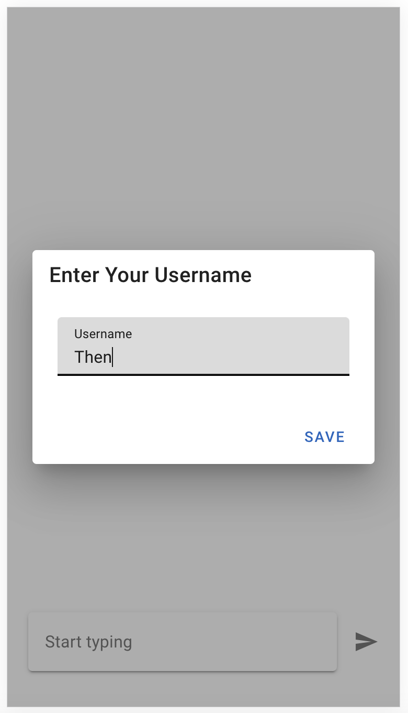
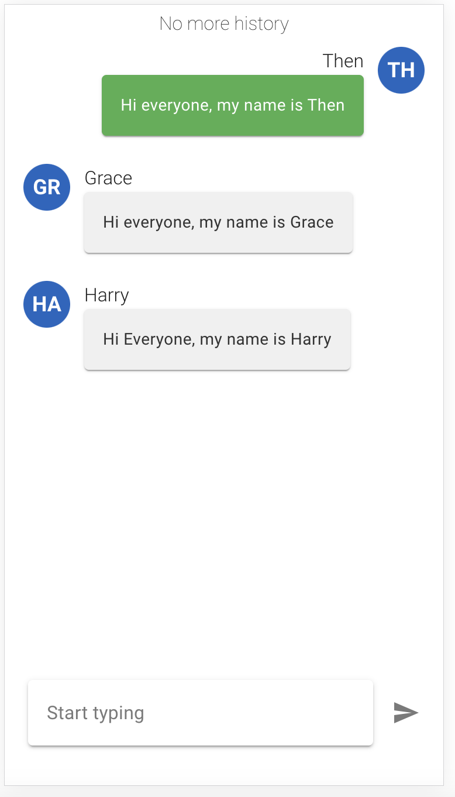
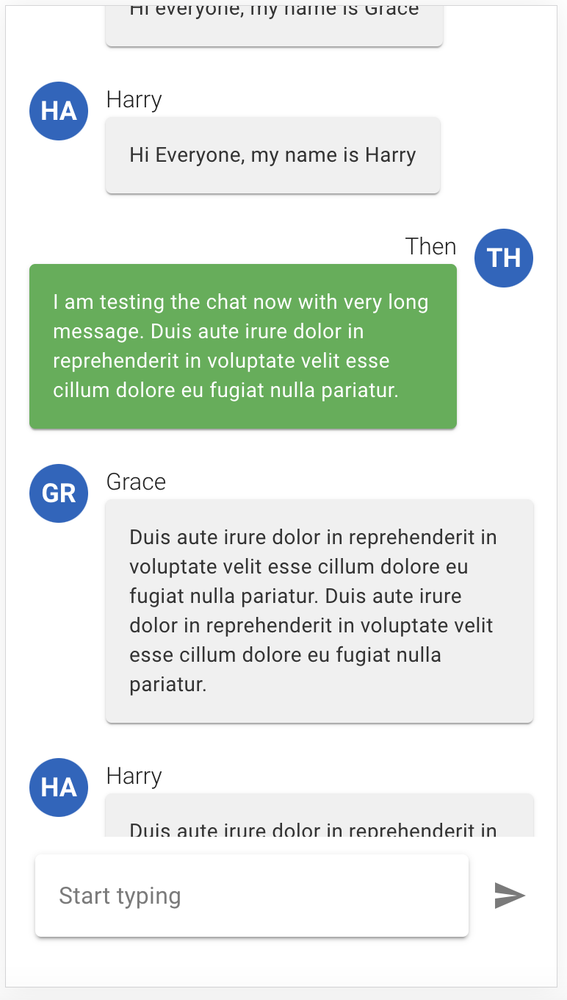
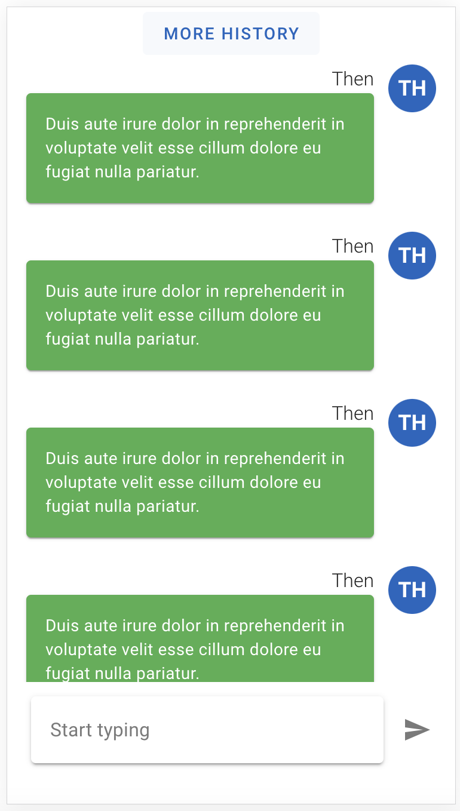
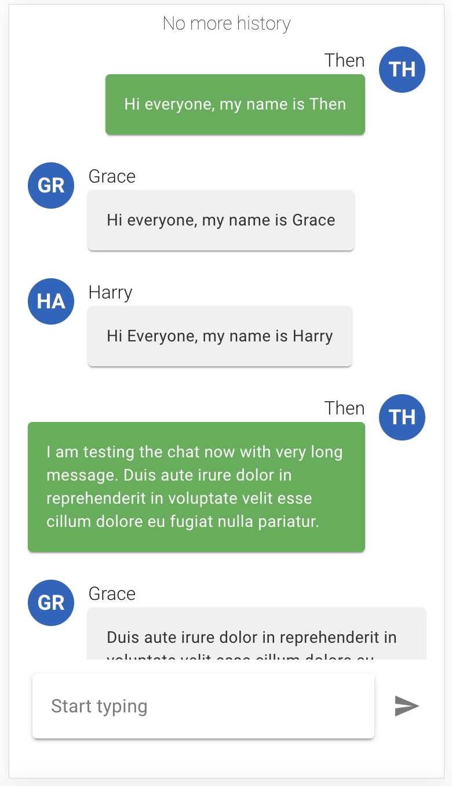

# Vue Chat Application

This is a simple web chat application built with Vue.js and Vuetify. The application allows users to enter their name before joining the chat, and their name is used to identify their messages. The chat supports live updates across multiple browser tabs, and messages are saved in local storage.

## Features

1. **User Authentication:**
   - Users are prompted to enter their name before joining the chat.
   - Users data in tab session even after refresh browser tab.

2. **Live Updates Across Tabs:**
   - Each new browser tab represents a new chat user.
   - Messages in the chat room are updated in real-time for all open tabs.

3. **Message Sending:**
   - Users can send messages to the chat.

4. **Message History:**
   - The chat displays message history.
   - Users can load more messages when scrolling to the top (page size = 25).

## 💡 Usage

This section covers how to start the development server and build your project for production.

### Starting the Development Server

To start the development server with hot-reload, run the following command. The server will be accessible at [http://localhost:3000](http://localhost:3000):

```bash
yarn dev
```

(Repeat for npm, pnpm, and bun with respective commands.)

### Building for Production

To build your project for production, use:

```bash
yarn build
```

(Repeat for npm, pnpm, and bun with respective commands.)

Once the build process is completed, your application will be ready for deployment in a production environment.

## Screenshots

- **User Authentication:**
  

- **Live Updates Across Tabs:**
  
  

- **Message History and Load More:**
  
  
